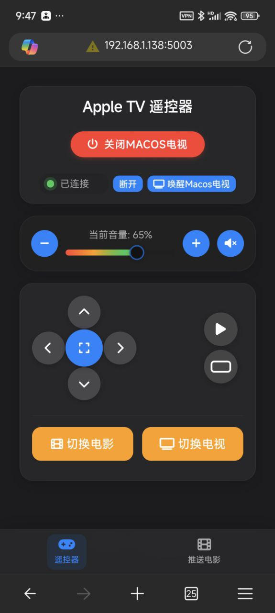

# Apple TV 遥控器 🖥️📱

一个基于 Flask 和 Socket.IO 的 Apple TV 远程控制应用，可以通过网页界面控制 Apple TV 或播放设备。

## 📖 项目介绍

闲置的 MacBook M1 改造成电视盒子的解决方案。满足同时观看电影和电视的需求，通过 WebSocket 实现无需红外线的远程控制，包括屏幕切换、视频播放和音量调节功能。系统唤醒采用咖啡操作，默认保持两小时。

### 演示与资源

- **B站演示**: [macbook 电视盒子，通过遥控器电影到电视节目互相切换](https://www.bilibili.com/video/BV1DoJBz4ErA/)
- **电影地址**: movie.tnanko.top

### 硬件配置

- C 对 HDMI 线 (60Hz) - ¥60
- N300 音响 (AUX 模式, 3.5mm 接口) - ¥699

### 使用方案

搭配油猴插件，左一屏显示电影，右一屏显示 APTV，实现电影和数字电视双重体验。

<div align="center">
  
</div>

<div align="center">
  
</div>

## ✨ 功能特点

- 📱 响应式网页界面，适配移动设备
- 🎮 远程控制 Apple TV 和播放设备
- 🔊 音量调节控制
- ⏯️ 播放/暂停控制
- 🖥️ 屏幕唤醒功能
- 📡 双向通信 - 一台设备的操作可同步到所有连接设备
- 🖼️ 桌面切换功能
- 📺 电影/电视切换按钮

## 🔧 系统要求

- Python 3.6+

## 🚀 安装步骤

1. 克隆仓库：

```bash
git clone https://github.com/yourusername/apptv.git
cd apptv
```

2. 安装依赖：

```bash
pip install flask flask-socketio
```

3. 运行服务器：

```bash
python main.py
```

4. 通过浏览器访问：

```
http://[您电脑的IP地址]:5003
```

## 🧩 浏览器扩展

项目包含一个油猴脚本，用于在浏览器中接收和处理远程命令：

1. 安装 [Tampermonkey](https://www.tampermonkey.net/) 浏览器扩展
2. 添加 `油猴插件/demo.js` 脚本到 Tampermonkey

## 📝 使用方法

1. 确保您的计算机和控制设备在同一网络中
2. 在计算机上运行服务器
3. 在移动设备浏览器中访问服务器地址
4. 使用界面控制 Apple TV 或播放设备
          
### 主要功能

- **音量控制** 🔊：调整系统音量
- **方向控制** 🎮：使用方向键控制导航
- **播放控制** ⏯️：播放/暂停当前媒体
- **屏幕唤醒** 🔆：防止系统进入睡眠状态
- **桌面切换** 🖼️：在不同桌面间切换，适用于全屏应用
- **电影推送** 🎬：电影推送网页到油猴插件，支持电影播放
- **硬件唤醒** ⚡：通过远程键盘协议 hid 进行唤醒操作

## 💻 技术实现

- **后端**：Flask + Flask-SocketIO
- **前端**：HTML + CSS + JavaScript + Socket.IO 客户端
- **系统交互**：通过 `osascript` 执行 AppleScript 命令

## 📁 项目结构

```
.
├── main.py             # Flask 服务器和主要功能
├── templates/          # HTML 模板
│   └── index.html      # 遥控器界面
├── static/             # 静态资源
│   ├── styles.css      # CSS 样式
│   ├── script.js       # 客户端 JavaScript
│   └── icons/          # 图标资源
└── 油猴插件/            # 浏览器扩展
    └── demo.js         # 油猴脚本
```

## 🛠️ 屏幕没有信号问题解决方案

注意在终端执行命令：
```bash
sudo pmset -a hibernatemode 0
```

该命令将休眠模式设置为仅内存模式，可以解决部分屏幕信号丢失问题。

### 更多电源管理命令

如需了解更多 macOS 电源管理命令，请参考项目中的 [macOS电源管理命令.md](macOS电源管理命令.md) 文件，其中包含：

- 📊 查看当前电源设置方法
- 💤 各种休眠模式详细说明
- 🖥️ 显示器、系统、硬盘睡眠时间设置
- 🔋 电池模式与充电模式的区别与设置
- ⚙️ 其他常用电源管理命令
